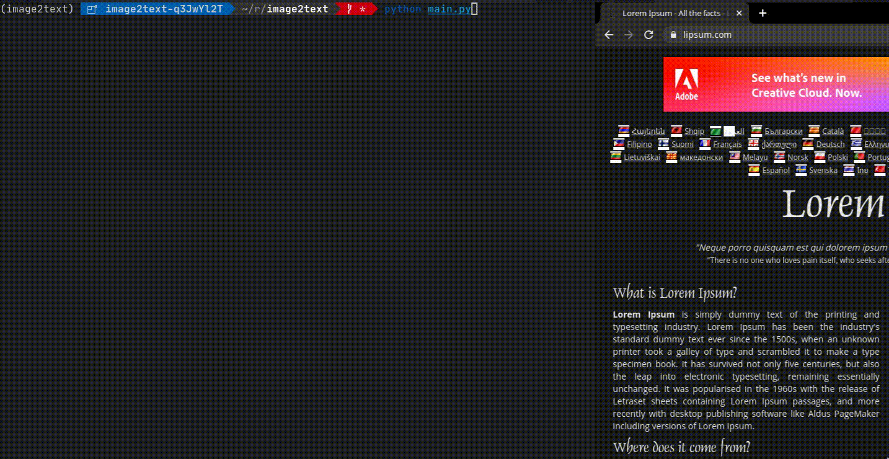

# image2text

Converts image to text in a selected area.

## Demo:


## Dependencies:
  - [tesseract](https://tesseract-ocr.github.io/tessdoc/Home.html)

## Build dependencies:
  - [python](https://www.python.org/downloads/)
  - [git](https://git-scm.com/book/en/v2/Getting-Started-Installing-Git)
  - [pipenv](https://pypi.org/project/pipenv/)

## Build Instruction:
```sh
$ git clone https://github.com/singalhimanshu/image2text`
$ cd image2text
$ pipenv shell
$ pipenv install
```

## Usage:
```sh
$ python main.py
```
After this select an area to convert into text.

## Install dev dependencies:
```sh
$ pipenv install --dev
```

## Contribute
If you have any suggestions, issues or feature request feel free to open an issue.